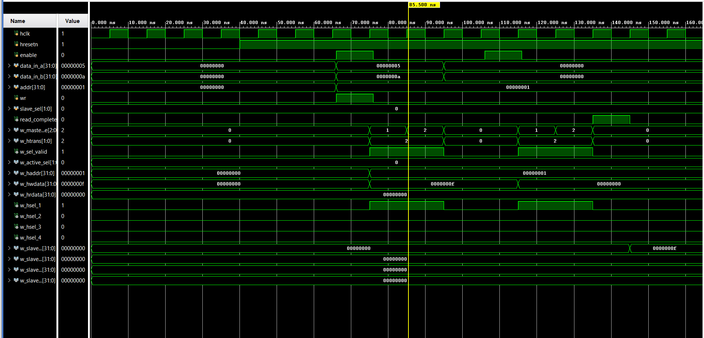

````html
<div align="center">


# AMBA AHB Single Master 4-Slave Interconnect

A Verilog HDL implementation of an AMBA AHB-inspired interconnect system featuring a single master, four memory-mapped slaves, address decoding, response multiplexing, and FSM-based read/write transactions.

<br>


</div>

---

# Overview

This project implements a simplified AMBA AHB-inspired bus architecture consisting of one master and four independent memory-mapped slaves.

The master initiates read and write transactions through a finite state machine (FSM). A decoder selects the target slave based on the slave select signal, while a multiplexer routes the response of the selected slave back to the master.

For write transactions, the master performs an arithmetic operation:

```text
HWDATA = DATA_IN_A + DATA_IN_B
````

and stores the result in the selected slave memory.

For read transactions, data is retrieved from the selected slave and a read completion signal is generated.

---

# Functional Block Diagram

<div align="center">


</div>

The architecture consists of:

<ul>
<li>AHB Master</li>
<li>Address Decoder</li>
<li>Four Memory-Mapped Slaves</li>
<li>Response Multiplexer</li>
</ul>

---

# RTL Structure

<div align="center">


</div>

The RTL schematic generated in Vivado verifies the hierarchical implementation of the design and demonstrates connectivity between the master, decoder, slaves, and multiplexer.

Key observations:

<ul>
<li>Centralized AHB Master</li>
<li>One-Hot Slave Selection</li>
<li>Shared Bus Architecture</li>
<li>Four Independent Slave Memories</li>
<li>Multiplexed Response Path</li>
</ul>

---

# Simulation Waveforms

<div align="center">



</div>

The simulation results verify:

<ul>
<li>Address Generation</li>
<li>Slave Selection</li>
<li>Write Transactions</li>
<li>Read Transactions</li>
<li>Data Routing Through Multiplexer</li>
<li>Read Completion Signaling</li>
<li>FSM State Transitions</li>
</ul>

---

# System Architecture

```text
                      +----------------+
                      |   AHB MASTER   |
                      +--------+-------+
                               |
                               |
                               v

                      +----------------+
                      |    DECODER     |
                      +--------+-------+
                               |

          +------------+------+------+------------+
          |            |             |            |

          v            v             v            v

      +------+     +------+      +------+     +------+
      |SLV 1 |     |SLV 2 |      |SLV 3 |     |SLV 4 |
      +------+     +------+      +------+     +------+

          |            |             |            |
          +------------+------+------+------------+
                               |
                               v

                      +----------------+
                      | MULTIPLEXER    |
                      +--------+-------+
                               |
                               |
                               v

                        Master Response
```

---

# Transaction Flow

```text
User Inputs
      |
      v

AHB Master
      |
      v

Address Generation
      |
      v

Decoder
      |
      v

Target Slave Selection
      |
      v

Memory Read / Write
      |
      v

Multiplexer
      |
      v

Master Receives Response
      |
      v

read_complete = 1
```

---

# Module Description

## 1. AHB Master

The AHB Master controls all bus operations through a finite state machine.

### FSM States

```text
IDLE
  |
  v
ADDR
  |
  v
DATA
  |
  +----> IDLE
```

### Responsibilities

<ul>
<li>Generates AHB control signals</li>
<li>Generates transaction addresses</li>
<li>Selects target slave</li>
<li>Performs arithmetic operation (A + B)</li>
<li>Initiates read transactions</li>
<li>Initiates write transactions</li>
<li>Generates read_complete signal</li>
</ul>

### Important Signals

| Signal        | Description            |
| ------------- | ---------------------- |
| haddr         | Address Bus            |
| hwdata        | Write Data             |
| hwrite        | Read/Write Control     |
| htrans        | Transfer Type          |
| sel           | Slave Select           |
| sel_valid     | Valid Slave Indicator  |
| read_complete | Read Completion Signal |

---

## 2. Decoder

The decoder converts the slave selection value into one-hot slave enable signals.

### Inputs

| Signal    |
| --------- |
| sel[1:0]  |
| sel_valid |

### Outputs

| Signal |
| ------ |
| hsel_1 |
| hsel_2 |
| hsel_3 |
| hsel_4 |

Only one slave is activated at a time.

---

## 3. AHB Slave

Each slave contains an independent 32 × 32 memory array.

### Features

<ul>
<li>Memory Storage</li>
<li>Read Operation Support</li>
<li>Write Operation Support</li>
<li>AHB Response Generation</li>
</ul>

### Outputs

| Signal    | Description           |
| --------- | --------------------- |
| hrdata    | Read Data             |
| hreadyout | Transfer Ready Signal |
| hresp     | Transfer Response     |

---

## 4. Multiplexer

The multiplexer routes the response of the selected slave back to the master.

### Functions

<ul>
<li>Selects slave read data</li>
<li>Selects slave response</li>
<li>Selects slave ready signal</li>
<li>Returns selected slave outputs to the master</li>
</ul>

---

# Features Implemented

✔ Single Master Architecture

✔ Four Memory-Mapped Slaves

✔ Decoder-Based Slave Selection

✔ Response Multiplexer

✔ FSM-Based Transaction Controller

✔ Read Transactions

✔ Write Transactions

✔ Arithmetic Data Generation (A + B)

✔ Read Completion Signaling

✔ Vivado RTL Verification

✔ Simulation Verification

---

# Test Scenarios Verified

<ul>
<li>Write to Slave 1</li>
<li>Read from Slave 1</li>
<li>Write to Slave 2</li>
<li>Read from Slave 2</li>
<li>Write to Slave 3</li>
<li>Read from Slave 3</li>
<li>Write to Slave 4</li>
<li>Read from Slave 4</li>
<li>Correct Decoder Operation</li>
<li>Correct Multiplexer Operation</li>
</ul>

---

# Project Directory

```text
AMBA-AHB-Single-Master-4-Slave
│
├── rtl
│   ├── ahb_master.v
│   ├── ahb_slave.v
│   ├── decoder.v
│   ├── multiplexer.v
│   └── ahb_top.v
│
├── tb
│   └── ahb_top_tb.v
│
├── images
│   ├── intro_ahb.png
│   ├── func_block_diagram.png
│   ├── rtl_structure.png
│   └── sim_waveform.png
│
└── README.md
```

---

# Tools Used

<ul>
<li>Verilog HDL</li>
<li>Xilinx Vivado</li>
<li>Vivado Simulator</li>
<li>RTL Schematic Viewer</li>
<li>GitHub</li>
</ul>

---

# Future Enhancements

<ul>
<li>Multi-Master Architecture</li>
<li>Bus Arbitration Logic</li>
<li>Enhanced Error Response Handling</li>
<li>Wait-State Support</li>
<li>Extended AHB Feature Support</li>
<li>FPGA Hardware Validation</li>
</ul>

---

# Results

✔ Successful Read Transactions

✔ Successful Write Transactions

✔ Correct Slave Selection

✔ Correct Data Routing

✔ Verified RTL Connectivity

✔ Verified Simulation Waveforms

✔ Synthesizable Verilog Design

---

# Author

<b>Ashish Kumar Kashyap</b>

B.Tech, Electronics and Communication Engineering

Motilal Nehru National Institute of Technology Allahabad (MNNIT Allahabad)

AMBA AHB RTL Design Project

```
```
