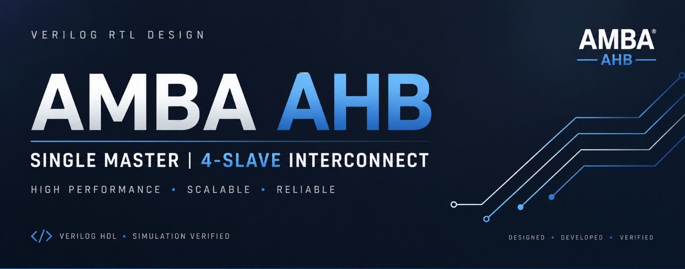
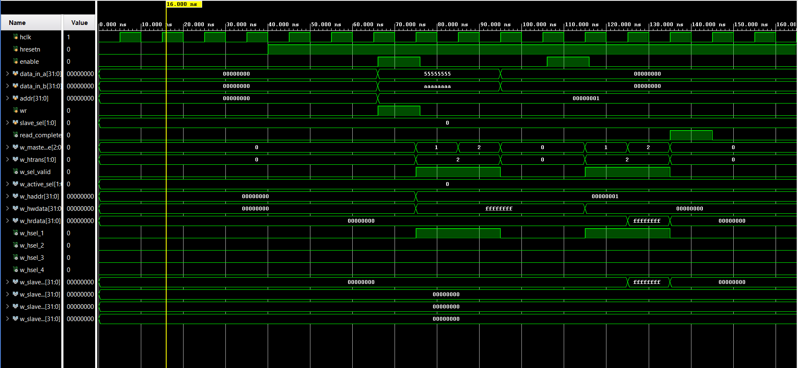
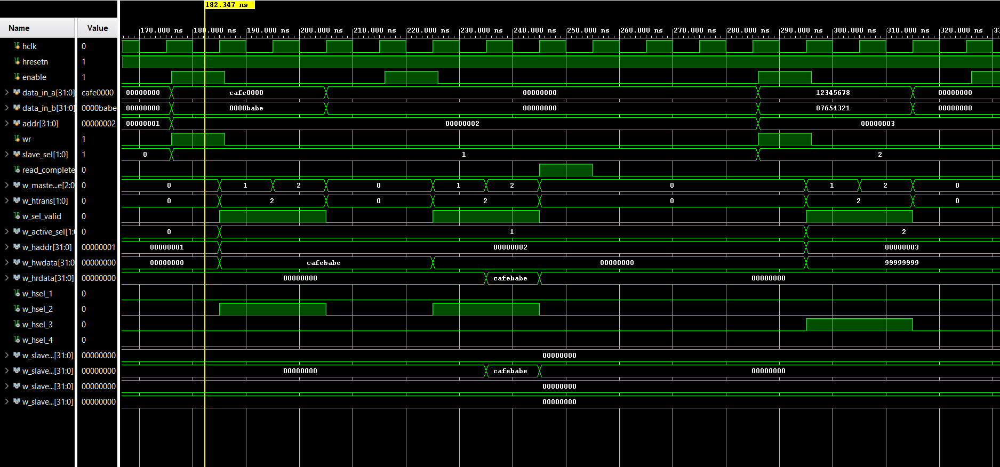
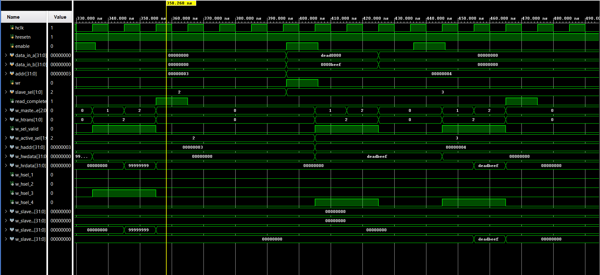
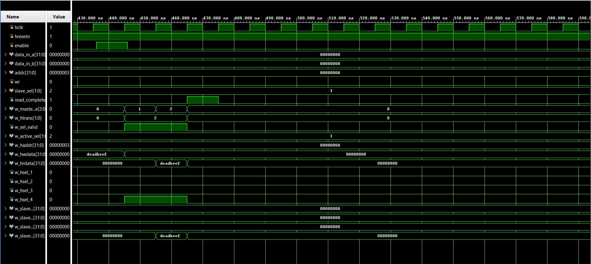

<h1>AMBA AHB Single Master 4-Slave Interconnect</h1>

A Verilog HDL implementation of an AMBA AHB-inspired interconnect system featuring a Single Master, Four Memory-Mapped Slaves, Address Decoder, Response Multiplexer, and FSM-Based Read/Write Transactions.

<h2>Introduction</h2>

The Advanced Microcontroller Bus Architecture (AMBA) is an industry-standard on-chip communication protocol developed by ARM. The Advanced High-performance Bus (AHB) is designed to provide high-speed communication between processors, memories, and peripherals within a System-on-Chip (SoC).

This project implements a simplified AHB-inspired interconnect consisting of a single master and four memory-mapped slaves. The design demonstrates address decoding, slave selection, read/write transactions, and response multiplexing using Verilog HDL.

<h2>Project Objective</h2>

The objective of this project is to design and verify a bus architecture capable of:

<ul>
<li>Selecting one of four slaves</li>
<li>Performing read transactions</li>
<li>Performing write transactions</li>
<li>Routing responses back to the master</li>
<li>Demonstrating hierarchical RTL design</li>
<li>Verifying functionality through simulation</li>
</ul>

<h2>Functional Block Diagram</h2>

The AMBA AHB interconnect consists of a Single Master, Decoder, Four Memory-Mapped Slaves, and a Response Multiplexer. The master initiates all bus transactions while the decoder selects the target slave based on the selection input.

<table>
<tr>
<th>Block</th>
<th>Function</th>
<th>Inputs</th>
<th>Outputs</th>
</tr>

<tr>
<td><b>AHB Master</b></td>
<td>Generates read/write transactions and controls bus operation through FSM states.</td>
<td>enable, data_in_a, data_in_b, addr, wr, slave_sel, hreadyout, hrdata</td>
<td>haddr, hwdata, hwrite, htrans, hsize, hburst, hprot, sel, sel_valid</td>
</tr>

<tr>
<td><b>Decoder</b></td>
<td>Converts slave selection into one-hot slave enable signals.</td>
<td>sel, sel_valid</td>
<td>hsel_1, hsel_2, hsel_3, hsel_4</td>
</tr>

<tr>
<td><b>AHB Slave 1</b></td>
<td>32-word memory used for read/write transactions.</td>
<td>hsel_1 and bus signals</td>
<td>hrdata_1, hreadyout_1, hresp_1</td>
</tr>

<tr>
<td><b>AHB Slave 2</b></td>
<td>32-word memory used for read/write transactions.</td>
<td>hsel_2 and bus signals</td>
<td>hrdata_2, hreadyout_2, hresp_2</td>
</tr>

<tr>
<td><b>AHB Slave 3</b></td>
<td>32-word memory used for read/write transactions.</td>
<td>hsel_3 and bus signals</td>
<td>hrdata_3, hreadyout_3, hresp_3</td>
</tr>

<tr>
<td><b>AHB Slave 4</b></td>
<td>32-word memory used for read/write transactions.</td>
<td>hsel_4 and bus signals</td>
<td>hrdata_4, hreadyout_4, hresp_4</td>
</tr>

<tr>
<td><b>Multiplexer</b></td>
<td>Selects response from active slave and routes it back to the master.</td>
<td>hrdata_x, hreadyout_x, hresp_x</td>
<td>hrdata, hreadyout, hresp</td>
</tr>

</table>

The master computes:

<pre>
HWDATA = DATA_IN_A + DATA_IN_B
</pre>

The generated data is written into the selected slave memory. During a read operation, the selected slave returns data through the multiplexer and the master asserts <b>read_complete</b>.

The system consists of an AHB Master, Decoder, Four Memory-Mapped Slaves, and a Multiplexer that returns the selected slave response to the master.

<h2>RTL Structure</h2>

The RTL schematic generated using Vivado verifies the complete connectivity between all modules and demonstrates the hierarchical hardware implementation of the design.

<ul>
<li>Master-to-Slave Communication</li>
<li>Decoder-Based Slave Selection</li>
<li>Shared Bus Architecture</li>
<li>Four Independent Slave Memories</li>
<li>Multiplexed Response Routing</li>
</ul>

<h2>Simulation Results</h2>

The design was verified using a dedicated testbench. Four independent transactions were performed to validate correct operation of all four memory-mapped slaves.

<h3>Simulation 1 – Slave 1 Transaction</h3>

<ul>
<li>Slave Selected = 00 (Slave 1)</li>
<li>Address = 1</li>
<li>DATA_IN_A = 0x55555555</li>
<li>DATA_IN_B = 0xAAAAAAAA</li>
<li>Master computes HWDATA = 0xFFFFFFFF</li>
<li>Decoder activates hsel_1</li>
<li>Data is written into Slave 1 memory</li>
<li>Read transaction returns 0xFFFFFFFF</li>
<li>read_complete asserted successfully</li>
<li>FSM transitions IDLE → ADDR → DATA → IDLE</li>
</ul>

<h3>Simulation 2 – Slave 2 Transaction</h3>

<ul>
<li>Slave Selected = 01 (Slave 2)</li>
<li>Address = 2</li>
<li>DATA_IN_A = 0xCAFE0000</li>
<li>DATA_IN_B = 0x0000BABE</li>
<li>Master computes HWDATA = 0xCAFEBABE</li>
<li>Decoder activates hsel_2</li>
<li>Data is stored inside Slave 2 memory</li>
<li>Read operation retrieves 0xCAFEBABE</li>
<li>Multiplexer forwards Slave 2 response</li>
<li>read_complete asserted successfully</li>
</ul>

<h3>Simulation 3 – Slave 3 Transaction</h3>

<ul>
<li>Slave Selected = 10 (Slave 3)</li>
<li>Address = 3</li>
<li>DATA_IN_A = 0x12345678</li>
<li>DATA_IN_B = 0x87654321</li>
<li>Master computes HWDATA = 0x99999999</li>
<li>Decoder activates hsel_3</li>
<li>Data written into Slave 3 memory</li>
<li>Read operation returns 0x99999999</li>
<li>Correct slave response selected by multiplexer</li>
<li>Transaction completed successfully</li>
</ul>

<h3>Simulation 4 – Slave 4 Transaction</h3>

<ul>
<li>Slave Selected = 11 (Slave 4)</li>
<li>Address = 4</li>
<li>DATA_IN_A = 0xDEAD0000</li>
<li>DATA_IN_B = 0x0000BEEF</li>
<li>Master computes HWDATA = 0xDEADBEEF</li>
<li>Decoder activates hsel_4</li>
<li>Data written into Slave 4 memory</li>
<li>Read operation returns 0xDEADBEEF</li>
<li>Response routed through multiplexer</li>
<li>read_complete asserted successfully</li>
</ul>

<ul>
<li>Address Generation</li>
<li>Slave Selection</li>
<li>Write Transactions</li>
<li>Read Transactions</li>
<li>Read Completion Signaling</li>
<li>FSM State Transitions</li>
</ul>

/

<h2>System Architecture</h2>

<pre>
                    +----------------+
                    |   AHB MASTER   |
                    +--------+-------+
                             |
                             v

                    +----------------+
                    |    DECODER     |
                    +--------+-------+
                             |

       +------------+------+------+------------+
       |            |             |            |

       v            v             v            v

   +------+     +------+      +------+     +------+
   |SLV 1 |     |SLV 2 |      |SLV 3 |     |SLV 4 |
   +------+     +------+      +------+     +------+

       |            |             |            |
       +------------+------+------+------------+
                             |
                             v

                    +----------------+
                    | MULTIPLEXER    |
                    +--------+-------+
                             |
                             v

                      Master Response
</pre>

<h2>📂 Project Structure</h2>

The repository is organized into separate directories for RTL source files,
testbench verification files, and project documentation resources.

<pre>
AMBA-AHB-Single-Master-4-Slave
│
├── README.md
│
├── images
├── intro_ahb.png
├── func_block_diagram.png
├── rtl_structure.png
├── sim_waveform_1.png
├── sim_waveform_2.png
├── sim_waveform_3.png
└── sim_waveform_4.png
│
├── rtl
│   ├── ahb_master.v
│   ├── ahb_slave.v
│   ├── decoder.v
│   ├── multiplexer.v
│   └── ahb_top.v
│
└── tb
    └── ahb_top_tb.v
</pre>

<b>images/</b> contains architectural diagrams, RTL schematics, and simulation waveforms used throughout the documentation.

<b>rtl/</b> contains synthesizable Verilog source files implementing the AMBA AHB Single Master 4-Slave architecture.

<b>tb/</b> contains the verification environment used to validate read and write transactions through simulation.

<h2>Working Principle</h2>

The master receives user inputs and initiates transactions through a finite state machine.

For write operations:

<pre>
HWDATA = DATA_IN_A + DATA_IN_B
</pre>

The computed value is stored in the selected slave memory.

For read operations, data is fetched from the selected slave and returned through the multiplexer. A read_complete signal indicates successful completion of the read transaction.

<h2>Module Description</h2>

<h3>AHB Master</h3>

<ul>
<li>FSM-Based Controller</li>
<li>Address Generation</li>
<li>Slave Selection</li>
<li>Arithmetic Operation (A + B)</li>
<li>Read/Write Transaction Control</li>
<li>Read Completion Generation</li>
</ul>

<h3>Decoder</h3>

<ul>
<li>Converts slave selection into one-hot slave enable signals</li>
<li>Activates only one slave at a time</li>
</ul>

<h3>AHB Slaves</h3>

<ul>
<li>32 × 32 Memory Array</li>
<li>Read Support</li>
<li>Write Support</li>
<li>Response Generation</li>
</ul>

<h3>Multiplexer</h3>

<ul>
<li>Selects active slave response</li>
<li>Routes data back to master</li>
<li>Selects hrdata, hreadyout, and hresp signals</li>
</ul>

<h2>Features Implemented</h2>

<ul>
<li>Single Master Architecture</li>
<li>Four Memory-Mapped Slaves</li>
<li>Decoder-Based Slave Selection</li>
<li>Response Multiplexer</li>
<li>FSM-Based Transaction Controller</li>
<li>Read Transactions</li>
<li>Write Transactions</li>
<li>Arithmetic Data Generation (A + B)</li>
<li>Read Completion Signaling</li>
<li>RTL Verification</li>
<li>Simulation Verification</li>
</ul>

<h2>Tools Used</h2>

<ul>
<li>Verilog HDL</li>
<li>Xilinx Vivado</li>
<li>Vivado Simulator</li>
<li>RTL Schematic Viewer</li>
<li>GitHub</li>
</ul>

<h2>Author</h2>

<b>Ashish Kumar Kashyap</b> 
B.Tech Electronics and Communication Engineering 
Motilal Nehru National Institute of Technology Allahabad

