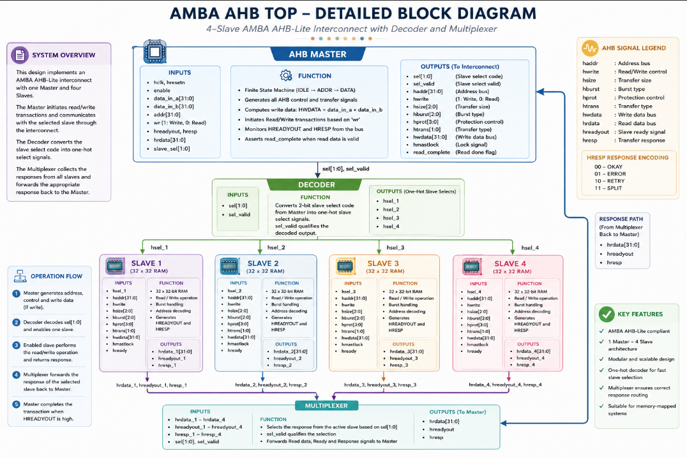
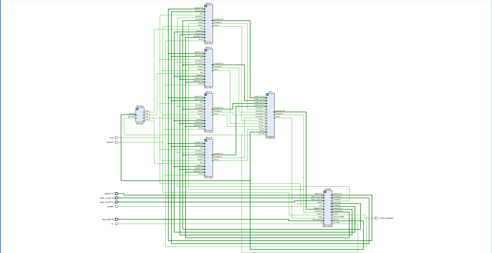

````md
<div align="center">


# AMBA AHB Single Master 4-Slave Interconnect

A Verilog HDL implementation of an AMBA AHB-inspired interconnect system featuring a Single Master, Four Memory-Mapped Slaves, Address Decoder, Response Multiplexer, and FSM-Based Read/Write Transactions.


</div>

---

## Overview

This project implements a simplified **AMBA AHB-inspired bus architecture** consisting of:

- One AHB Master
- Four Memory-Mapped Slaves
- Address Decoder
- Response Multiplexer
- FSM-Based Transaction Controller
- Read and Write Transactions

The master initiates transactions through a finite state machine (FSM). The decoder selects the target slave based on the slave select signal, while the multiplexer routes the selected slave response back to the master.

For write transactions, the master performs:

```text
HWDATA = DATA_IN_A + DATA_IN_B
````

The computed value is stored in the selected slave memory.

For read transactions, data is retrieved from the selected slave and a `read_complete` signal is generated.

---

## Functional Block Diagram

<p align="center">
  
</p>

The architecture consists of:

* AHB Master
* Decoder
* Four Memory-Mapped Slaves
* Response Multiplexer

---

## RTL Structure

<p align="center">
  
</p>

The RTL schematic generated in Vivado verifies the hierarchical implementation of the complete design.

### RTL Highlights

* Centralized AHB Master
* Decoder-Based Slave Selection
* Shared Bus Architecture
* Four Independent Slave Memories
* Multiplexed Response Path

---

## Simulation Waveforms

<p align="center">
  
</p>

The simulation verifies:

* Address Generation
* Slave Selection
* Write Transactions
* Read Transactions
* Multiplexer Operation
* Read Completion Signaling
* FSM State Transitions

---

## System Architecture

```text
                      +----------------+
                      |   AHB MASTER   |
                      +--------+-------+
                               |
                               v

                      +----------------+
                      |    DECODER     |
                      +--------+-------+
                               |

          +------------+------+------+------------+
          |            |             |            |

          v            v             v            v

      +------+     +------+      +------+     +------+
      |SLV 1 |     |SLV 2 |      |SLV 3 |     |SLV 4 |
      +------+     +------+      +------+     +------+

          |            |             |            |
          +------------+------+------+------------+
                               |
                               v

                      +----------------+
                      | MULTIPLEXER    |
                      +--------+-------+
                               |
                               v

                        Master Response
```

---

## Transaction Flow

```text
User Inputs
      |
      v
AHB Master
      |
      v
Address Generation
      |
      v
Decoder
      |
      v
Target Slave Selection
      |
      v
Memory Read / Write
      |
      v
Multiplexer
      |
      v
Master Receives Response
      |
      v
read_complete = 1
```

---

## Module Description

### 1. AHB Master

The master controls all bus operations using a finite state machine.

#### FSM States

```text
IDLE
  |
  v
ADDR
  |
  v
DATA
  |
  +----> IDLE
```

#### Responsibilities

* Generates AHB control signals
* Generates transaction addresses
* Selects target slave
* Computes `A + B`
* Initiates write transactions
* Initiates read transactions
* Generates `read_complete`

#### Important Signals

| Signal        | Description            |
| ------------- | ---------------------- |
| haddr         | Address Bus            |
| hwdata        | Write Data             |
| hwrite        | Read/Write Control     |
| htrans        | Transfer Type          |
| sel           | Slave Select           |
| sel_valid     | Valid Slave Indicator  |
| read_complete | Read Completion Signal |

---

### 2. Decoder

The decoder converts slave selection information into one-hot slave enable signals.

#### Inputs

* sel[1:0]
* sel_valid

#### Outputs

* hsel_1
* hsel_2
* hsel_3
* hsel_4

Only one slave remains active at a time.

---

### 3. AHB Slave

Each slave contains an independent 32 × 32 memory array.

#### Features

* Memory Storage
* Read Operations
* Write Operations
* Response Generation

#### Outputs

| Signal    | Description     |
| --------- | --------------- |
| hrdata    | Read Data       |
| hreadyout | Ready Signal    |
| hresp     | Response Signal |

---

### 4. Multiplexer

The multiplexer routes the response of the active slave back to the master.

#### Functions

* Selects read data
* Selects ready signal
* Selects response signal
* Routes outputs to master

---

## Features Implemented

* Single Master Architecture
* Four Memory-Mapped Slaves
* Decoder-Based Slave Selection
* Response Multiplexer
* FSM-Based Transaction Controller
* Read Transactions
* Write Transactions
* Arithmetic Data Generation (A + B)
* Read Completion Signaling
* RTL Verification
* Simulation Verification

---

## Test Scenarios Verified

* Write to Slave 1
* Read from Slave 1
* Write to Slave 2
* Read from Slave 2
* Write to Slave 3
* Read from Slave 3
* Write to Slave 4
* Read from Slave 4
* Decoder Verification
* Multiplexer Verification

---

## Project Structure

```text
AMBA-AHB-Single-Master-4-Slave
│
├── README.md
├── intro_ahb.png
├── func_block_diagram.png
├── rtl_structure.png
├── sim_waveform.png
│
├── rtl/
│   ├── ahb_master.v
│   ├── ahb_slave.v
│   ├── decoder.v
│   ├── multiplexer.v
│   └── ahb_top.v
│
└── tb/
    └── ahb_top_tb.v
```

---

## Tools Used

* Verilog HDL
* Xilinx Vivado
* Vivado Simulator
* RTL Schematic Viewer
* GitHub

---

## Future Enhancements

* Multi-Master Support
* Arbitration Logic
* Advanced AHB Features
* Error Response Handling
* FPGA Hardware Validation

---

## Results

✅ Successful Read Transactions

✅ Successful Write Transactions

✅ Correct Slave Selection

✅ Correct Multiplexer Routing

✅ Verified RTL Connectivity

✅ Verified Simulation Waveforms

✅ Synthesizable RTL Design

---

## Author

**Ashish Kumar Kashyap**

B.Tech, Electronics and Communication Engineering

Motilal Nehru National Institute of Technology Allahabad (MNNIT Allahabad)

```
```
